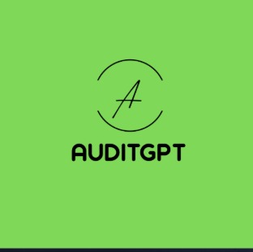

<p align="center">
  
</p>

<h1 align="center">AuditGPT</h1>

<p align="center">
  <strong>NSE Forensic Intelligence Engine</strong><br/>
  Quantitative fraud detection for Indian equity markets
</p>

<p align="center">
  
  
  
  
  
  
</p>

<p align="center">
  Built for <strong>IAR Udaan Hackathon 2026 · Day 3 · Problem #01</strong> · Solo · 30 hours
</p>

---

Input a company name → AuditGPT fetches 10 years of NSE financial data → runs four forensic models simultaneously → outputs a composite fraud risk score (0–100), an anomaly heatmap, a red flag timeline, peer sector comparison, sentiment trend, and a streaming LLM forensic narrative. Every signal is benchmarked against industry peers, not just absolute thresholds.

---

> **NSE Forensic Intelligence Engine** — quantitative fraud detection for Indian equity markets, powered by Beneish M-Score, Altman Z-Score, industry-adjusted anomaly detection, and Gemini LLM narrative synthesis.

## Pages

| Route | Page | Description |
|---|---|---|
| `/` | Landing | Marketing page with live demo strip and model overview |
| `/radar` | Fraud Radar | Sector grid sorted by risk · search · company drill-down panel |
| `/report/:id` | Forensic Report | Full dashboard for a single company |
| `/critical` | Critical Section | NSE-wide threat matrix heatmap + contagion splash zone |
| `/satyam` | Satyam Case Study | Year-by-year reconstruction of India's largest corporate fraud (2000–2009) |

---

## Tech Stack

| Layer | Technology |
|---|---|
| Frontend | React 18 + Vite |
| Backend | FastAPI (Python 3.11+) · Uvicorn |
| Hosting | Vercel (frontend) · Railway (backend) |
| Quant Engine | pandas · numpy · scipy |
| LLM | Google Gemini 1.5 Flash · SSE streaming |
| Sentiment | VADER |
| Charts | Recharts · custom SVG |
| Data | Pre-cached JSON (Screener.in format) · no database |
| Fonts | JetBrains Mono · Space Grotesk |

**Design system:** Bloomberg Terminal dark — `#070b12` background · `#00ff88` green · `#ffb020` amber · `#ff4455` red · `#00d4ff` cyan.

---

## Detection Models

### Composite Score Weights

| Model | Weight | What It Detects | Normalization |
|---|---|---|---|
| Beneish M-Score | 35% | Earnings manipulation via 8 accrual variables | `min(max((M+3)/5×100, 0), 100)` |
| Altman Z-Score | 30% | Financial distress / bankruptcy risk | `min(max((4−Z)/4×100, 0), 100)` |
| Industry-Adjusted Z | 25% | Peer-relative ratio outliers (12 ratios) | `min((avg_abs_z/3)×100, 100)` |
| Trend Breaks | 10% | Structural breaks in financial time series | `(break_count/12)×100` |

**Risk thresholds:** `0–25` Low · `26–50` Medium · `51–75` High · `76–100` Critical

### Beneish M-Score Variables

DSRI · SGI · GMI · AQI · DEPI · SGAI · TATA · LVGI — all 8 variables decomposed individually, charted over time, and compared against the −1.78 manipulation threshold.

### Altman Z-Score Zones

| Zone | Range |
|---|---|
| Safe | Z > 2.99 |
| Grey | 1.81 < Z < 2.99 |
| Distress | Z < 1.81 |

---

## Backtested Accuracy

| Model | Metric | Result |
|---|---|---|
| Beneish M-Score | Detection rate | 76% |
| Altman Z-Score | 2-year prediction accuracy | 82% |
| Industry Z-Score | Anomaly detection accuracy | 71% |
| Ensemble (all 4) | Combined accuracy | **92%** |

---

## Getting Started

### Prerequisites

- Python 3.11+
- Node.js 18+
- Google Gemini API key (free tier works)

### Install

```bash
git clone https://github.com/your-username/auditgpt
cd auditgpt

# Backend
pip install -r backend/requirements.txt

# Frontend
cd frontend && npm install
```

### Environment Variables

```bash
# backend/.env
GEMINI_API_KEY=your_key_here

# frontend/.env.local
VITE_API_URL=http://localhost:8000/api
```

### Add Company Data

Drop Screener.in-format JSON files into `backend/data/companies/`. Each file should be named `{COMPANY_ID}.json`.

### Precompute Scores

Walks all company JSONs, runs the full quant pipeline, builds peer groups by sector, and writes `reports/{id}.json` + `sector_summary.json`.

```bash
python scripts/precompute.py
```

### Run

```bash
# Terminal 1 — Backend
uvicorn backend.main:app --reload --port 8000

# Terminal 2 — Frontend
cd frontend && npm run dev
```

Open [http://localhost:5173](http://localhost:5173)

---

## API Reference

```
GET  /api/sectors                  → Sector summary sorted by avg risk score desc
GET  /api/sectors/{sector_name}    → All companies in sector sorted by risk desc
GET  /api/search?q={query}         → Fuzzy search, returns top 10 matches
GET  /api/report/{company_id}      → Full ForensicReport (scores + peers + financials + sentiment)
GET  /api/stream/{company_id}      → SSE stream of Gemini LLM narrative
```

<details>
<summary>Company JSON shape (Screener.in format)</summary>

```json
{
  "company_id": "TCS",
  "company_name": "Tata Consultancy Services",
  "sector": "IT Services",
  "market_cap": 868235.0,
  "profit_loss": {
    "Sales+": { "Mar 2014": 81809, "Mar 2015": 94648 },
    "Net Profit+": {}
  },
  "balance_sheet": {
    "Total Assets": {},
    "Reserves": {},
    "Borrowings+": {}
  },
  "cash_flow": {
    "Cash from Operating Activity+": {}
  },
  "ratios": {
    "Debtor Days": {},
    "Working Capital Days": {}
  }
}
```

Years are `"Mar YYYY"` format. TTM and Sep/Jun quarter keys are filtered out by the engine.

</details>

<details>
<summary>ForensicReport response shape</summary>

```json
{
  "company_id": "TCS",
  "company_name": "Tata Consultancy Services",
  "sector": "IT Services",
  "composite_score": 11.4,
  "risk_level": "LOW",
  "risk_reasoning": "...",
  "breakdown": {
    "beneish_normalized": 8.2,
    "altman_normalized": 12.1,
    "industry_z_normalized": 14.0,
    "trend_break_normalized": 0.0
  },
  "beneish": { "m_score": -2.91, "manipulation_likely": false, "components": {} },
  "altman":  { "z_score": 4.21, "zone": "safe", "components": {} },
  "anomaly_map": { "Debtor Days": { "Mar 2015": -0.3 } },
  "red_flags": [ { "flag_type": "...", "severity": "HIGH", "first_appeared": 2019 } ],
  "peer_companies": [ { "name": "Infosys", "composite_score": 9.2 } ],
  "financial_data": { "profit_loss": {}, "balance_sheet": {} },
  "sentiment_trend": { "Mar 2020": -0.12 },
  "narrative": null
}
```

</details>

---

## Report Dashboard

| Section | Description |
|---|---|
| Fraud Score Gauge | SVG ring gauge, 0–100, color-coded by risk tier |
| Score Breakdown | Weighted bar chart of all 4 model contributions |
| Anomaly Heatmap | Industry-adjusted Z-scores for 12 ratios × 10 years — hover for exact σ |
| Red Flag Timeline | Chronological anomalies with severity, year, and industry context |
| Peer Comparison | Bar chart benchmarking against all sector peers |
| M-Score Analysis | Full Beneish decomposition with all 8 components |
| Z-Score Analysis | Full Altman decomposition with zone indicator |
| Financial Trend | Revenue vs Net Profit over 10 years |
| Sentiment Trend | VADER sentiment bar chart (positive/negative by year) |
| Narrative | Gemini 1.5 Flash forensic narrative — click Generate to stream |
| Replay Mode | Heatmap and timeline re-render year-by-year to show fraud developing |

---

## Satyam Case Study `/satyam`

An interactive reconstruction of the Satyam Computer Services fraud (2000–2009) — India's largest corporate fraud at the time, ₹5,040 Cr in fabricated cash.

- Year-by-year narrative with staggered event reveals
- Live Beneish M-Score trajectory chart showing the exact year the −1.78 threshold was crossed
- Animated metric tiles for DSRI, SGI, GMI, AQI, TATA
- Fabricated cash fill bar growing from ₹0 to ₹5,040 Cr
- Play/pause/speed controls · click any year node to jump

> The model flagged probable manipulation in **2004**. The confession came in **January 2009**.

---

## Project Structure

```
auditgpt/
├── backend/
│   ├── api/
│   │   ├── routes.py          # All API endpoints + in-memory LRU cache
│   │   └── schemas.py         # Pydantic request/response models
│   ├── data/
│   │   ├── companies/         # Pre-cached company JSONs (TCS.json, etc.)
│   │   ├── reports/           # Pre-computed score JSONs per company
│   │   ├── auditor_notes/     # Auditor commentary data
│   │   ├── rpt/               # Related party transaction data
│   │   └── sector_summary.json
│   ├── engine/
│   │   ├── quantitative.py    # Beneish, Altman, industry Z, trend breaks
│   │   ├── scoring.py         # Composite score orchestrator
│   │   └── sentiment.py       # VADER sentiment analysis
│   ├── llm/
│   │   ├── client.py          # Gemini 1.5 Flash integration + SSE
│   │   └── knowledge_base/    # Domain knowledge for prompting
│   └── main.py                # FastAPI app entry point
├── frontend/src/
│   ├── components/
│   ├── pages/
│   ├── App.jsx
│   └── main.jsx
├── scripts/
│   ├── fetch_data.py          # Pulls raw financial data
│   └── precompute.py          # Precompute runner
└── fraud_signatures/
    └── satyam.json
```

---

## License

MIT — built for hackathon purposes. Not financial advice. Do not use as the sole basis for investment decisions.

<p align="center">
  <sub>AuditGPT · NSE Forensic Intelligence · FY2026 · IAR Udaan Hackathon</sub>
</p>
